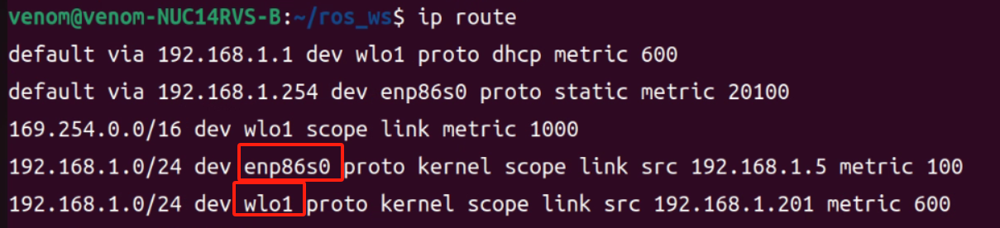
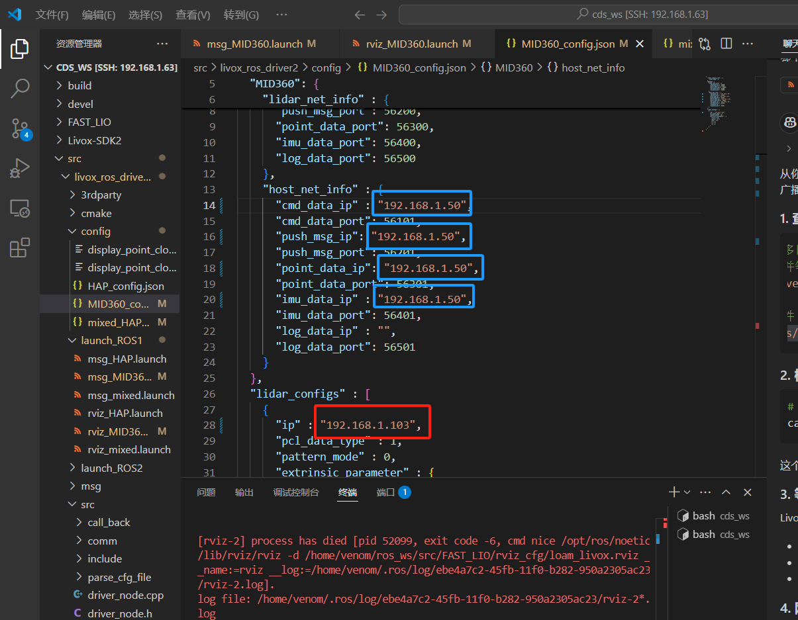
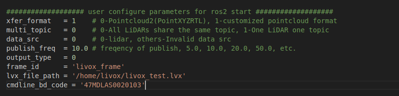

## 安装 Livox-SDK2

```bash
cd ~
sudo apt update
sudo apt install -y cmake git
git clone https://github.com/Livox-SDK/Livox-SDK2.git
cd Livox-SDK2
mkdir -p build
cd build
cmake ..
make -j$(nproc)
sudo make install
sudo ldconfig
```

## 检查是否安装成功

`ldconfig -p | grep LivoxSdkCore` 对当前 Livox-SDK2 安装结果不够可靠。更直接的检查方式是看 `livox_ros_driver2` 编译时真正会查找的 SDK 库文件是否存在：

```bash
ls /usr/local/lib/liblivox_lidar_sdk_shared.so
ls /usr/local/lib/liblivox_lidar_sdk_static.a
```

如果第一条能看到 `liblivox_lidar_sdk_shared.so`，说明 ROS 2 驱动后续链接 SDK 的关键动态库已经安装到位。

## 卸载旧版 Livox-SDK2

如果需要清理旧版本，可执行：

```bash
sudo rm -rf /usr/local/lib/liblivox_lidar_sdk_*
sudo rm -rf /usr/local/include/livox_lidar_*
```

## 准备 livox_ros_driver2

仓库已经通过 submodule 提供 `driver/livox_ros_driver2`，构建前需要先执行：

```bash
cp ~/venom_ws/src/venom_vnv/driver/livox_ros_driver2/package_ROS2.xml \
   ~/venom_ws/src/venom_vnv/driver/livox_ros_driver2/package.xml
```

## livox_ros_driver2 常用命令

本仓库标准构建仍使用 [快速开始](../home/quick_start.md) 中的 `colcon build` 命令。`livox_ros_driver2` 官方 README 还提供了一个独立构建脚本，可用于单独验证驱动包：

```bash
cd ~/venom_ws/src/venom_vnv/driver/livox_ros_driver2
source /opt/ros/humble/setup.bash
./build.sh humble
```

这个脚本会清理 `~/venom_ws/build`、`~/venom_ws/install` 等构建目录，所以常规整包编译仍优先使用主仓库的标准 build 命令。

官方 ROS 2 启动命令格式是：

```bash
cd ~/venom_ws
source install/setup.bash
ros2 launch livox_ros_driver2 <launch_file>
```

MID360 常用 launch：

| 命令 | 作用 |
| --- | --- |
| `ros2 launch livox_ros_driver2 rviz_MID360_launch.py` | 连接 MID360，发布 PointCloud2 格式点云，并自动打开 RViz |
| `ros2 launch livox_ros_driver2 msg_MID360_launch.py` | 连接 MID360，发布 Livox 自定义点云消息 |

如果启动时报类似 `cannot open shared object file`，先在当前终端补充动态库路径：

```bash
export LD_LIBRARY_PATH=${LD_LIBRARY_PATH}:/usr/local/lib
```

## 配置网卡静态 IP

建议把连接 Mid360 的有线网卡配置为静态 IP。
点击桌面左上角网络图标，进入设置，进入networks，点击wired的设置图标，点击IPv4，method选择Manual，输入以下数字。

推荐配置：

- 本机有线网卡 IP address：`192.168.1.50`（自行输入你主机的IP）
- 子网掩码netmask：`255.255.255.0`
- 网关gateway：`192.168.1.1`

Mid360 默认地址通常为：

- `192.168.1.1xx`

其中 `xx` 是雷达序列号后两位。比如序列号末两位是 `33`，则雷达 IP 可对应理解为 `192.168.1.133`，请自行查看雷达后面贴的标识。

配置完成后，WiFi 可以继续保持联网，用于 SSH、NoMachine 或其他网络访问。

网络优先级示意：



## 配置雷达路由优先级

如果电脑同时连接 WiFi 和雷达有线网口，系统可能会把 `192.168.1.0/24` 这个整段路由挂到有线网卡上，影响其他网络访问。现场调试时可以把整段路由删掉，只保留到雷达 IP 的单机路由。

先查看当前路由表：

```bash
ip route
```

在输出中找到连接雷达的有线网卡那一行，通常类似：

```text
192.168.1.0/24 dev enp3s0 proto kernel scope link src 192.168.1.50 metric 100
```

不要直接复制下面示例命令。每台电脑的有线网卡名、主机 IP、metric 和雷达 IP 都可能不一样，必须从你自己的 `ip route` 输出里复制网卡名，并把雷达 IP 改成实际值。

先删除有线网卡上的整段路由：

```bash
sudo ip route del 192.168.1.0/24 dev enp3s0
```

再新增只指向雷达本机 IP 的路由。下面以雷达 IP `192.168.1.133`、本机有线网卡 IP `192.168.1.50`、网卡名 `enp3s0` 为例：

```bash
sudo ip route add 192.168.1.133/32 dev enp3s0 src 192.168.1.50 metric 100
```

检查系统访问雷达时是否走有线网卡：

```bash
ip route get 192.168.1.133
ping 192.168.1.133
```

如果重启后需要自动恢复这条路由，可以把删除旧路由和新增单机路由的命令写入 [rc.local](rc_local.md)。

## 修改 MID360 配置文件

打开：

```text
~/venom_ws/src/venom_vnv/driver/livox_ros_driver2/config/MID360_config.json
```

重点确认以下字段：

```json
"cmd_data_ip": "192.168.1.50",
"push_msg_ip": "192.168.1.50",
"lidar_ip": "192.168.1.133"
```

其中：

- `cmd_data_ip` 和 `push_msg_ip` 应与本机有线网卡静态 IP 一致
- `lidar_ip` 应改成你自己 Mid360 的实际 IP

如果已经完成编译，也建议同步检查安装目录下的配置文件：

```text
~/venom_ws/install/livox_ros_driver2/share/livox_ros_driver2/config/MID360_config.json
```

配置文件示意：



如果还需要同步检查 launch 文件中的相关配置，可参考：

- `livox_ros_driver2/launch_ROS2/rviz_MID360_launch.py`
- `livox_ros_driver2/launch_ROS2/msg_MID360_launch.py`

对应示意：



## 雷达验证

先测试网络是否连通：

```bash
ping 192.168.1.133
```

如果你的雷达不是这个地址，请把上面的 IP 替换成实际值。

然后启动驱动验证：

```bash
cd ~/venom_ws
source install/setup.bash
ros2 launch livox_ros_driver2 rviz_MID360_launch.py
```

## 下一步

如果你还需要处理网络优先级、静态路由或开机自动执行这些命令，请继续阅读 [rc.local](rc_local.md).

## 相关文档

- [环境准备](environment.md)
- [Livox 雷达驱动](../modules/drivers/livox_ros_driver2.md)
- [快速开始](../home/quick_start.md)
