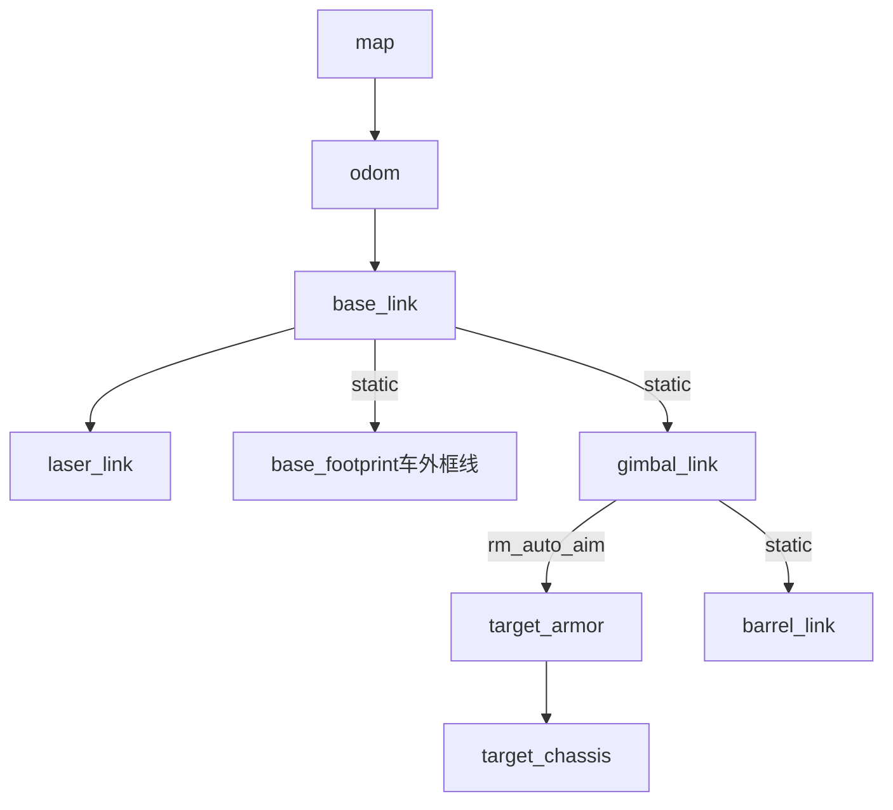

# TF Tree

System-level coordinate frame hierarchy used across the robot stack.

## Frame Hierarchy

## Frame 说明

| Frame | 父 Frame | 变换类型 | 发布者 | 说明 |
|---|---|---|---|---|
| `map` | — | — | 定位模块 | 全局地图坐标系 |
| `odom` | `map` | dynamic | 里程计 | 里程计坐标系 |
| `base_link` | `odom` | dynamic | 底盘 | 机器人本体中心 |
| `laser_link` | `base_link` | static | URDF / static broadcaster | 激光雷达安装位置 |
| `base_footprint` | `base_link` | static | URDF / static broadcaster | 机器人在地面的投影框线 |
| `gimbal_link` | `base_link` | static | URDF / static broadcaster | 云台基座坐标系 |
| `target_armor` | `gimbal_link` | dynamic | `rm_auto_aim` | 当前目标装甲板坐标系 |
| `target_chassis` | `target_armor` | dynamic | `rm_auto_aim` | 目标车体中心坐标系 |
| `barrel_link` | `gimbal_link` | static | URDF / static broadcaster | 枪管坐标系 |

## 关键说明

- LIO 模块统一负责发布 `odom -> base_link`，当前接入的 Point-LIO / Fast-LIO 都必须遵守这一点。
- `base_link → laser_link` / `base_footprint` / `gimbal_link` / `barrel_link` 均为 **static transform**，由 URDF 或 static_transform_publisher 发布，不随运行时状态改变。
- `gimbal_link → target_armor` 由 **rm_auto_aim** 节点在检测到目标时动态发布；未检测到目标时该变换不存在。
- `target_armor → target_chassis` 表示从装甲板反推目标车体中心的变换，同样由 rm_auto_aim 发布。
