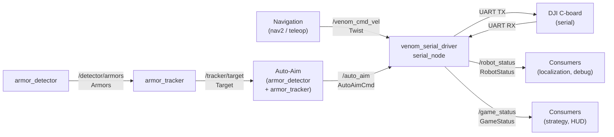

# Topic Map

System-level ROS 2 topic reference for the venom_vnv robot stack.

## Data Flow

---

## Topics by Module

### Teleop (`venom_teleop`)

| Direction | Topic | Message Type | Publisher / Subscriber | Description |
|---|---|---|---|---|
| Publish | `/venom_cmd_vel` | `geometry_msgs/Twist` | `venom_teleop` | Keyboard chassis velocity command. `linear.x/y` = translation; `angular.z` = chassis rotation. |

### Serial Driver (`venom_serial_driver`)

| Direction | Topic | Message Type | Publisher / Subscriber | Description |
|---|---|---|---|---|
| Subscribe | `/venom_cmd_vel` | `geometry_msgs/Twist` | venom_teleop / nav2 | Chassis velocity command. `linear.x/y/z` = translation; `angular.z` = chassis rotation (rad/s). |
| Subscribe | `/auto_aim` | `venom_serial_driver/AutoAimCmd` | auto-aim controller | Gimbal angle commands and aim state flags merged into the C-board control frame. |
| Publish | `/robot_status` | `venom_serial_driver/RobotStatus` | `serial_node` | Chassis velocity and gimbal angle feedback from the C-board. |
| Publish | `/game_status` | `venom_serial_driver/GameStatus` | `serial_node` | RoboMaster game state: HP, heat, game progress, RFID, etc. |

### Auto-Aim Pipeline (`rm_auto_aim`)

| Direction | Topic | Message Type | Publisher / Subscriber | Description |
|---|---|---|---|---|
| Subscribe | `/image_raw` | `sensor_msgs/Image` | camera driver | Raw camera image input. |
| Subscribe | `/camera_info` | `sensor_msgs/CameraInfo` | camera driver | Camera intrinsic parameters. |
| Publish | `/detector/armors` | `auto_aim_interfaces/Armors` | `armor_detector` | Detected armor plates in the current frame. |
| Publish | `/tracker/target` | `auto_aim_interfaces/Target` | `armor_tracker` | EKF-tracked target: position, velocity, yaw, tracking state. |
| Publish | `/tracker/info` | `auto_aim_interfaces/TrackerInfo` | `armor_tracker` | EKF debug info: position/yaw residuals. |

### Localization (`lio` / `relocalization`)

| Direction | Topic | Message Type | Publisher / Subscriber | Description |
|---|---|---|---|---|
| Publish | `/odom` | `nav_msgs/Odometry` | Point-LIO / Fast-LIO | Standardized LiDAR-inertial odometry output. |
| Publish | `/cloud_registered` | `sensor_msgs/PointCloud2` | Point-LIO / Fast-LIO | Registered point cloud in the `odom` frame. |
| Publish | `/cloud_registered_body` | `sensor_msgs/PointCloud2` | Point-LIO / Fast-LIO | Registered point cloud in the `base_link` frame. |
| Publish | `/map_cloud` | `sensor_msgs/PointCloud2` | Point-LIO / Fast-LIO | Low-frequency visualization map cloud in the `odom` frame. |
| Publish | `/path` | `nav_msgs/Path` | Point-LIO / Fast-LIO | Integrated local path in the `odom` frame. |
| Subscribe | `/livox/lidar` | `livox_ros_driver2/CustomMsg` | Point-LIO / Fast-LIO | Livox LiDAR point cloud input. |
| Subscribe | `/livox/imu` | `sensor_msgs/Imu` | Point-LIO / Fast-LIO | IMU input for the LIO estimator. |

---

## Message Field Reference

### `venom_serial_driver/AutoAimCmd`

Sent by the auto-aim controller to `serial_node`. All angle values are in radians.

| Field | Type | Description |
|---|---|---|
| `header` | `std_msgs/Header` | Timestamp and frame ID |
| `pitch` | `float64` | Gimbal pitch angle command (rad) |
| `yaw` | `float64` | Gimbal yaw angle command (rad) |
| `detected` | `bool` | Target detected in current frame |
| `tracking` | `bool` | EKF tracker actively tracking a target |
| `fire` | `bool` | Fire permission from aim controller |
| `distance` | `float64` | Estimated distance to target (m) |
| `proj_x` | `int32` | Reprojected target pixel x coordinate |
| `proj_y` | `int32` | Reprojected target pixel y coordinate |

**C-board control frame mapping:**

| `RobotCtrlData` field | Source |
|---|---|
| `lx / ly / lz` | `/venom_cmd_vel` linear.x/y/z |
| `chassis_wz` | `/venom_cmd_vel` angular.z |
| `ay` | `pitch` |
| `az` | `yaw` |
| `flags` bit 0 | `detected` |
| `flags` bit 1 | `tracking` |
| `flags` bit 2 | `fire` |
| `dist` | `distance` |
| `frame_x / frame_y` | `proj_x / proj_y` |

### `venom_serial_driver/RobotStatus`

| Field | Type | Description |
|---|---|---|
| `velocity` | `geometry_msgs/Twist` | Chassis linear velocity (m/s) and gimbal angle (rad) from C-board |
| `angular_speed` | `geometry_msgs/Twist` | Gimbal angular velocity (rad/s) |

### `venom_serial_driver/GameStatus`

| Field | Type | Description |
|---|---|---|
| `timestamp_us` | `uint32` | C-board timestamp (microseconds) |
| `game_progress` | `uint8` | Game stage (0=not started, 4=in progress, 5=ended) |
| `stage_remain_time` | `uint16` | Remaining time in current stage (s) |
| `center_outpost_occupancy` | `uint8` | Center outpost occupancy flags |
| `hp_percentage` | `float64` | Current HP / maximum HP |
| `shooter_barrel_heat_limit` | `uint16` | Barrel heat limit |
| `power_management` | `uint8` | Power management status |
| `shooter_17mm_barrel_heat` | `uint16` | 17mm barrel current heat |
| `shooter_42mm_barrel_heat` | `uint16` | 42mm barrel current heat |
| `armor_id` | `uint8` | ID of last hit armor plate |
| `hp_deduction_reason` | `uint8` | Reason code for last HP deduction |
| `launching_frequency` | `float64` | Current projectile launch frequency (Hz) |
| `initial_speed` | `float64` | Projectile initial speed (m/s) |
| `projectile_allowance_17mm` | `uint16` | Remaining 17mm projectile allowance |
| `projectile_allowance_42mm` | `uint16` | Remaining 42mm projectile allowance |
| `rfid_status` | `uint32` | RFID zone status bitmask |
| `distance` | `float64` | Distance measurement from C-board (m) |
